# Touchdesigner Audioreact love (FR)

*[english version](https://github.com/LucieMrc/TD_audioreact_love_EN)*

**Ou comment générer des visuels audio-réactifs sur TouchDesigner pour faire des dingz.**

## Setup audio-réactif

On peux soit ouvrir un fichier son avec un CHOP `Audio File In`, ou écouter le son venant du micro de l'ordinateur avec `Audio Device In`.

Si on veux écouter du son depuis youtube ou spotify ou autre, il faut installer un logiciel permettant de faire un câble audio virtuel pour que le son sorte dans TouchDesigner au lieu de sortir dans les hauts-parleurs.

## Spectre sonore en visuel

Inspiré des tutoriels de [Bileam Tschepe](https://www.youtube.com/@elekktronaut) et [PPPANIK](https://www.youtube.com/@pppanik2040).

En sortie du `Audio Device In`, mettre un `Audio Spectrum` qui sort dans un TOP `Chop to`.

 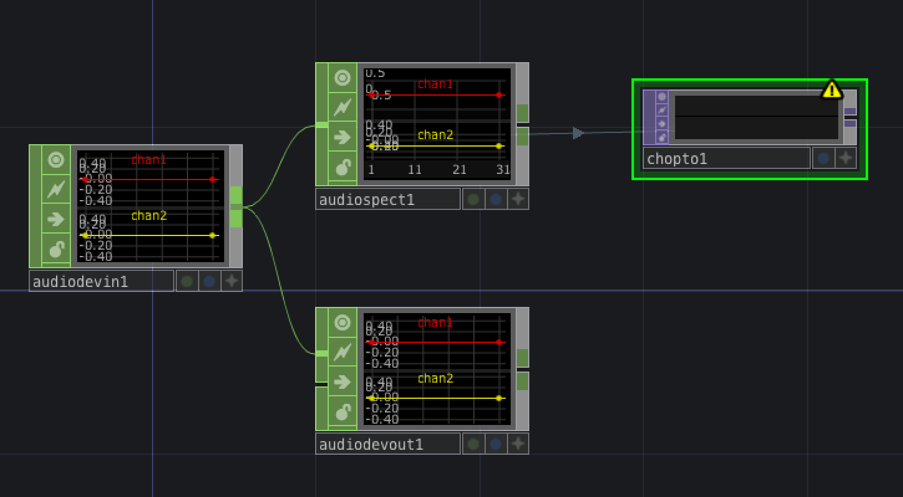

 On peux régler des trucs dans les paramètres de l'`Audio Spectrum`, pour booster les fréquences hautes par exemples, ou mettre des CHOP de réglages audio avant, mais je ne le fais pas.

 Dans le `Chop to`, choisir "RG" comme Data Format. Les deux channels de gauche et droite deviennent donc les valeurs de rouge (R) et de vert (G).

 On a donc une bande de couleurs et de noir de 1 pixel de haut, où les bandes de fréquences apparaissent en rouge ou en vert en fonction de la stéréo, ou en jaune par synthèse additive. L'intensité de la couleur dépend donc de le hauteur de la bande de fréquence sur le spectre.

 Pour transformer cette bande de couleurs en image, on crée un TOP `Constant` sur fond noir, auquel on donne une résolution de 1080*1920.

 On met un `Composite` en sortie du `Constant`, et on ajoute le `CHOP to` au `Composite`.

 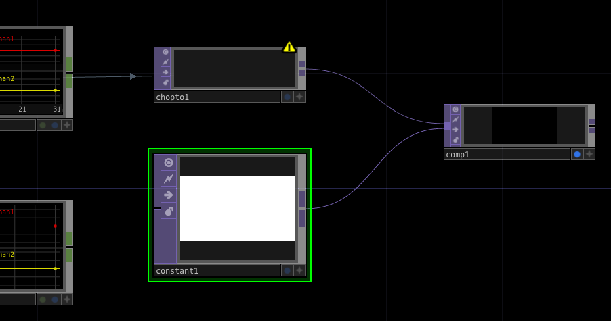

 On a ainsi une image de base avec les fréquences en couleurs en fonction de la stéréo, que l'on peux ensuite continuer à travailler.
 
 *Le piano de l'intro de "Tout Le Monde" de Neniu*

 
 *Le début de "I'm Not In Love" de 10cc, où on voit la basse en jaune qui revient à gauche*

 
 *Le moment où le son est spatialisé et passe d'un coté à l'autre dans "Ridin" de Cordon; où on voit bien les fréquences devenir vertes puis rouges puis vertes*

## Analyse audio dans Touchdesigner

TouchDesigner a un node dédié à l'analyse audio, mais la qualité de l'analyse varie énormément en fonction des sons.

 
*"Doudou" de Aya Nakamura* 

Dans le dossier "Tools" de la Palette, on récupère le node `audioAnalysis`.
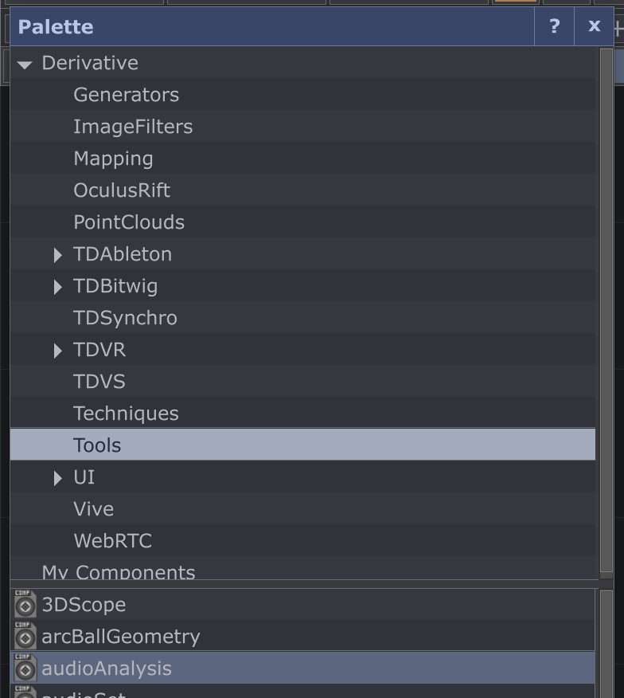

blablbla tous les paramètres
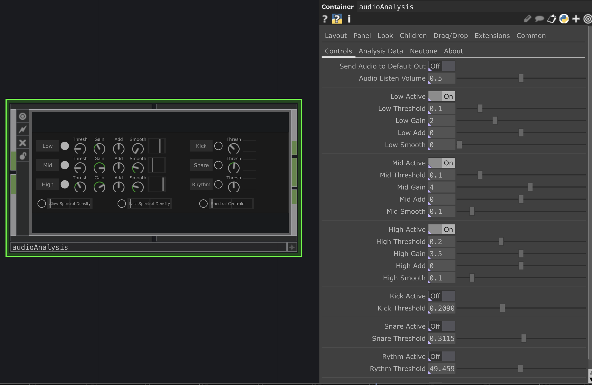

blabla les sorties
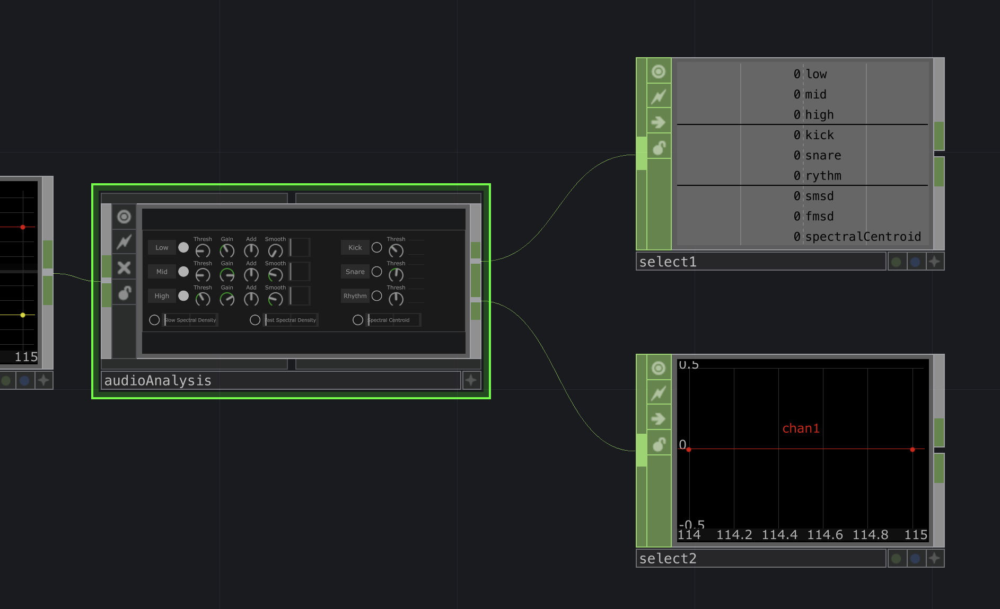

## Ajouter un contrôleur Midi en mode VJing

## Câble audio virtuel sous mac
Perso, j'utilise [BlackHole](https://existential.audio/blackhole/) sur Mac.

Ouvrir l'application `Configuration audio et MIDI`, qui se trouve dans le dossier Application > Utilitaires.

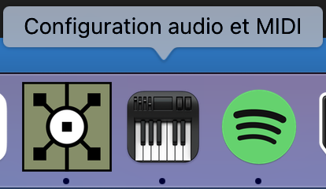

Une fois dans l'application, faire `Créer un périphérique à sortie multiple`.

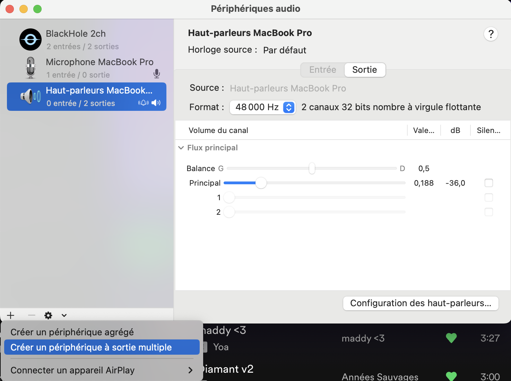

Cocher "BlackHole (2ch)".

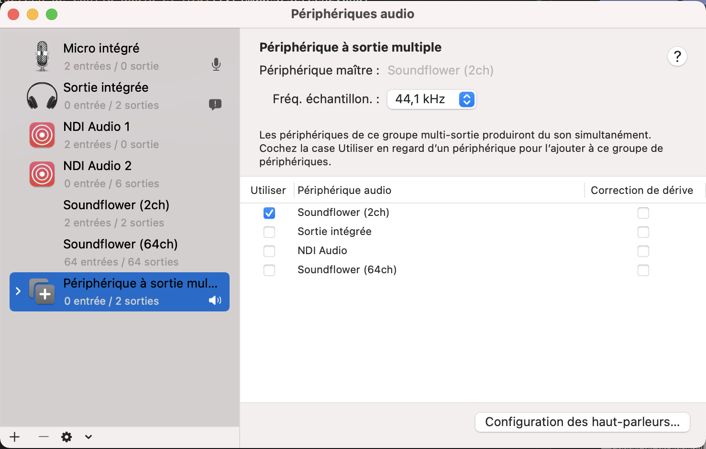

Dans TouchDesigner, créer un `Audio Device In` et sélectionner "BlackHole (2ch)" comme Device.

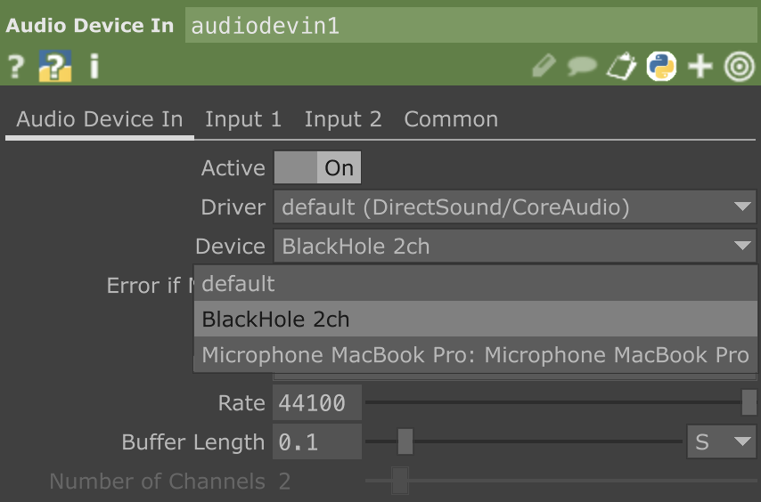

Créer un `Audio Device Out` en sortie, et sélectionner "Built-In Output" comme Device, pour que le son sorte dans la sortie son de l'ordi.

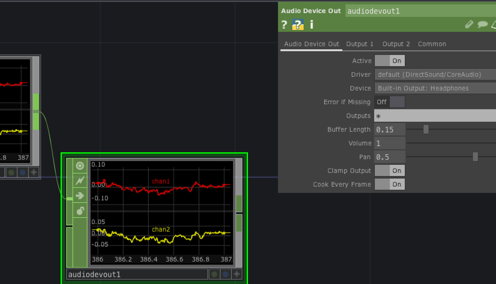

Le son de l'ordinateur sort donc dans BlackHole, est récupéré par TouchDesigner depuis BlackHole, et sort de TouchDesigner dans la sortie son de l'ordinateur (mes écouteurs ou les hauts-parleurs de mon ordi) : son de l'ordi > BlackHole > TouchDesigner > sortie son

Le mieux est de mettre le son à fond sur la source (Spotify, etc), et de le baisser ensuite dans l'`Audio Device Out`.

On pourrait cocher également "Sortie Intégrée" dans le périphérique à sortie multiple de l'appli Configuration audio et MIDI, pour que le son sorte à la fois dans BlackHole et dans la sortie son, sans avoir à le sortir depuis TouchDesigner, en mode son de l'ordi > BlackHole > TouchDesigner + son de l'ordi > sortie son, mais comme TouchDesigner perd en FPS parfois, je veux que la musique que j'entend reste synchro à mon visuel même quand ça ralentis.

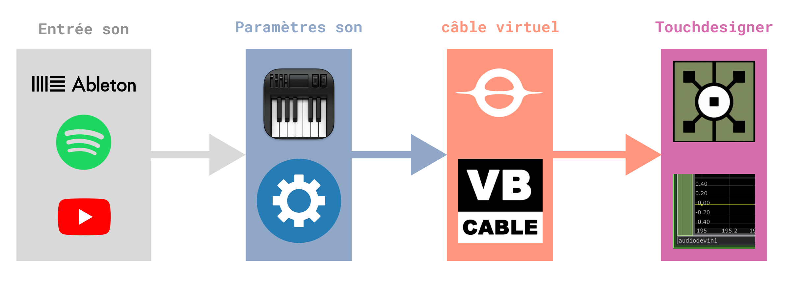

## Câble audio virtuel sous windows

Même principe mais avec [Virtual Audio Cable](https://vb-audio.com/Cable/), Elekktronaut en a fait une vidéo récemment : ["Internal Audio to TouchDesigner"](https://www.elekktronaut.com/tutorials/internal-audio-to-touchdesigner).

## Pour aller + loin

- Le [tuto introduction à Touchdesigner](https://github.com/LucieMrc/IntroTD_FR) (FR).

- Le tuto [Feedback loop in TD](https://github.com/LucieMrc/TD_feedback_love_EN) (EN).